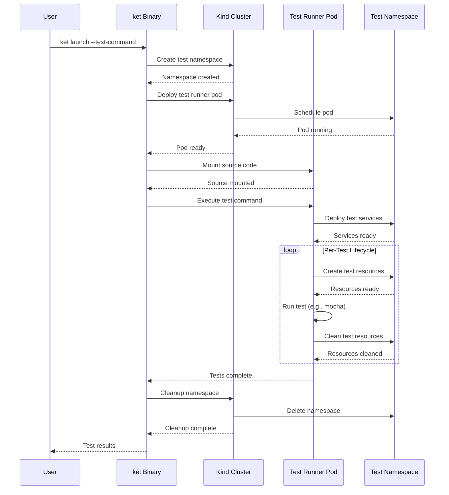

# Kubernetes Test Runner

A framework for running integration tests in Kubernetes with traffic interception capabilities.

## Overview

This project provides `ket` (Kubernetes Embedded Testing), a tool that:
- Deploys test runners in isolated Kubernetes namespaces
- Mounts source code via hostPath volumes (optimized for Kind clusters)
- Supports traffic interception with mirrord (optional)
- Automatically cleans up test resources

## Quick Start

```bash
# Build the binary
make build

# Run tests against a target pod
./kubernetes-embedded-testing/bin/ket launch \
  --target-pod my-app \
  --target-namespace default \
  --test-command "npm test" \
  --image node:18-alpine
```

## Examples

- **Node.js/TypeScript**: `example/nodejs-typescript/` - Mocha tests with Express server and MongoDB
- **Go HTTP Server**: `example/go-http-server/` - Go tests with HTTP server

## Architecture



**Key Components:**
- **Isolated Testing**: Each test run gets a unique namespace
- **HostPath Mounting**: Direct source code access for fast iteration
- **Graceful Fallback**: Works with or without traffic interception
- **Automatic Cleanup**: Resources cleaned up after test completion

## Requirements

- Kubernetes cluster (Kind recommended)
- Go 1.24+
- Docker

## Development

```bash
make build    # Build binary
make test     # Run tests
make lint     # Lint code
make clean    # Clean build artifacts
```

See `kubernetes-embedded-testing/README.md` for detailed development information.
