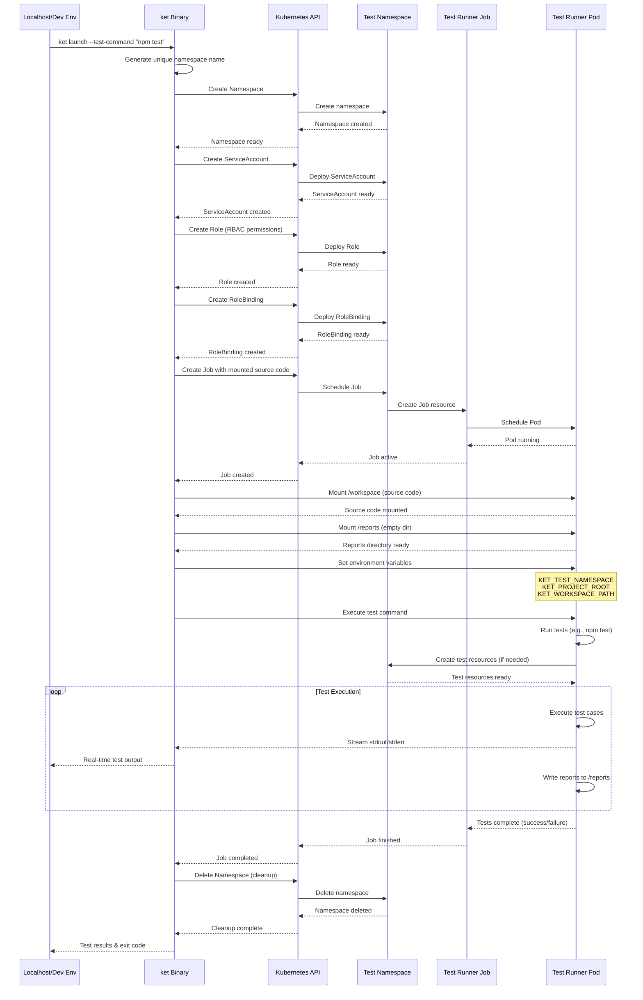

# ket - Kubernetes Embedded Testing

A Go-based tool for deploying and running tests in isolated Kubernetes environments.

## Architecture



## Key Components

- **Isolated Testing**: Each test run gets a unique namespace
- **RBAC Setup**: ServiceAccount, Role, and RoleBinding for test permissions
- **Source Code Mounting**: HostPath volume for direct code access
- **Environment Variables**: Test scripts have access to namespace and path info
- **Automatic Cleanup**: Resources cleaned up after test completion

## Command Reference

### Global Flags

| Flag | Description | Default |
|------|-------------|---------|
| `--config, -c` | Path to config file | - |
| `--debug, -v` | Enable debug logging | `false` |
| `--image, -i` | Runner image | `node:18-alpine` |
| `--cluster-workspace-path, -w` | Workspace path in pod | `/workspace` |
| `--project-root, -r` | Project root path | `.` |

### Launch Flags

| Flag | Description | Default | Required |
|------|-------------|---------|----------|
| `--test-command, -t` | Test command to execute | - | ✅ |
| `--keep-namespace, -k` | Keep test namespace | `false` | ❌ |
| `--backoff-limit, -b` | Job backoff limit | `1` | ❌ |
| `--active-deadline-seconds, -d` | Job deadline in seconds | `1800` | ❌ |

### Commands

- `ket launch` - Run tests in Kubernetes
- `ket manifest` - Generate Kubernetes manifests
- `ket env` - Show environment variables documentation

## Development

### Project Structure

```
pkg/
├── config/     # Configuration and file loading
├── kube/       # Kubernetes operations
│   ├── apply/  # Cluster resource application
│   ├── generate/ # Kubernetes object generation
│   └── manifest/ # YAML marshaling
├── launcher/   # Job launch orchestration
└── logger/     # Structured logging

cmd/
└── testrunner/ # CLI entry point
```

### Building

```bash
make build      # Build binary
make test       # Run tests
make lint       # Lint code
make clean      # Clean artifacts
```

### Testing

```bash
# Run all tests
make test

# Run with coverage
make test-coverage-summary

# Run specific package
make test-coverage-pkg PKG=pkg/launcher
```

### Requirements

- Go 1.24+
- Kubernetes cluster (Kind recommended)
- kubectl configured
- Docker (for building)
